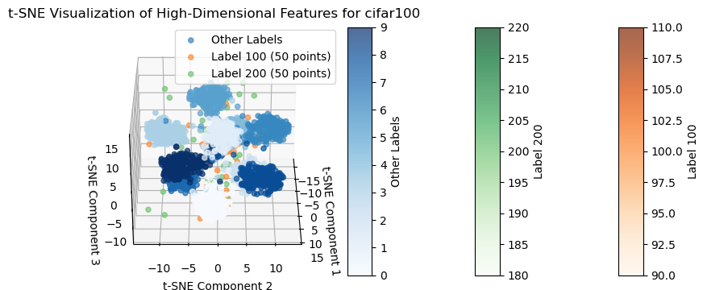
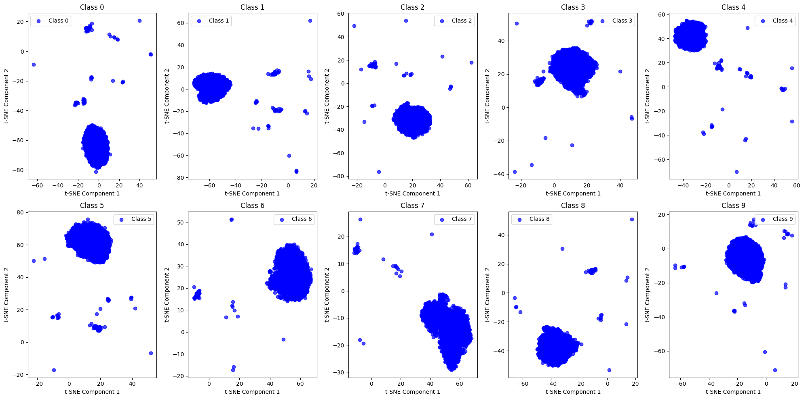
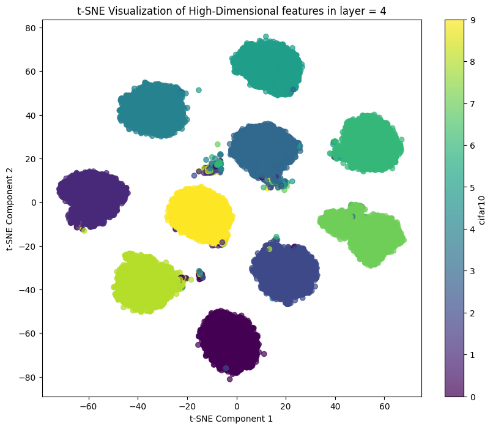

# Probabilistic Modelling of Features

Exploratory notebooks for probabilistic and geometric analysis of deep feature representations,
with emphasis on class-wise structure and adversarial robustness.

---

## Visual gallery

<div align="center">

| CIFAR-100 t-SNE | Different Classes |
|:---------------:|:-----------------:|
| {width=350} | {width=350} |

<br/>

{width=700}

**Figure:** Final-layer embedding geometry of the trained model.

</div>

---

## Notebooks

- `notebooks/visualize only two classes.ipynb` — focused two-class embedding analysis.  
- `notebooks/visualize_features_deeply.ipynb` — multi-class and adversarial analysis.  
- `notebooks/visualizations.ipynb` — additional plots.  
- `notebooks/GMM_Resnet.ipynb` — GMM / model experiments.

## How to run

Interactive (recommended):
```bash
conda create -n featviz python=3.9
conda activate featviz
pip install -r requirements.txt
jupyter lab
# then open a notebook and run cells
