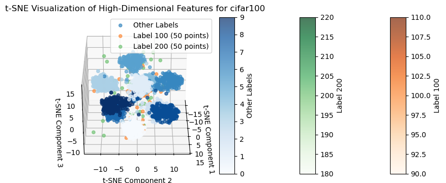
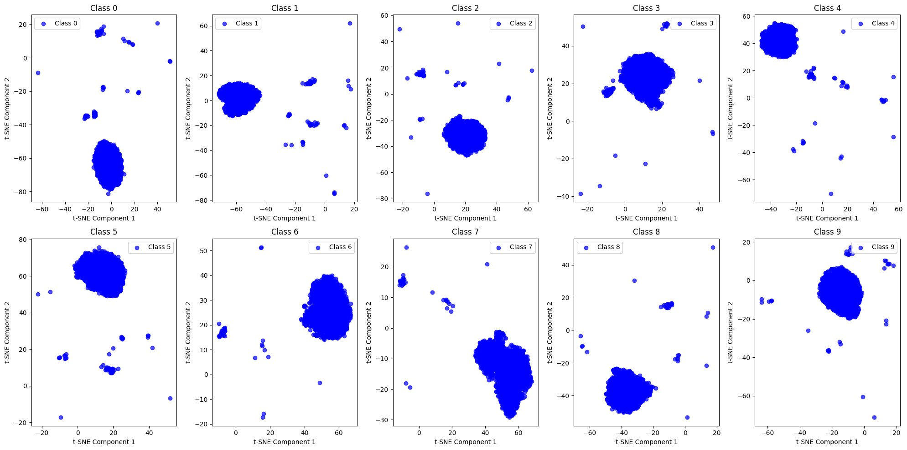
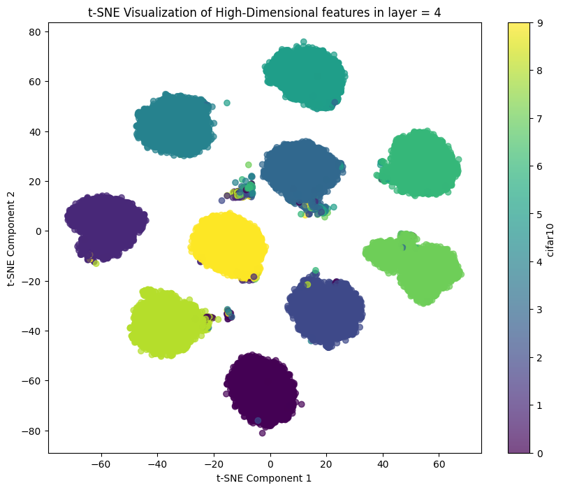
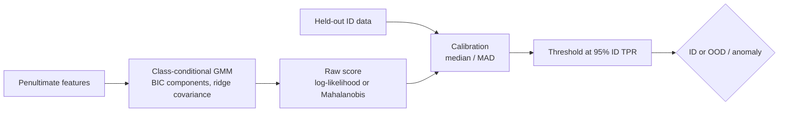

<div align="center">

# featprob

**Probabilistic modelling of deep features: class-conditional GMMs for calibrated OOD and anomaly scoring.**

[](https://github.com/amanyagami/Probablistic-modelling-of-features/actions/workflows/ci.yml)
[](LICENSE)

[](https://docs.astral.sh/uv/)

<br/>

<table>
  <tr>
    <td align="center"><br/><sub>t-SNE on CIFAR-100</sub></td>
    <td align="center"><br/><sub>Different classes</sub></td>
  </tr>
  <tr>
    <td align="center" colspan="2"><br/><sub>Final-layer embedding of the trained model (t-SNE)</sub></td>
  </tr>
</table>

</div>

## Quick start

Environment is managed with [uv](https://docs.astral.sh/uv/) (`uv.lock` is committed).

```bash
uv sync                  # core + dev tools
uv sync --extra torch    # + torch/torchvision (feature extraction)
uv sync --extra viz      # + umap-learn   (--extra opentsne for openTSNE)
uv run pytest
uv run python notebooks/00_quickstart.py   # synthetic end-to-end demo
```

## Usage

```python
from featprob import ClassConditionalGMM

# X_train: (n, d) features, y_train: labels, X_cal: held-out ID features (not the training set)
model = ClassConditionalGMM(max_components=4, random_state=0, n_jobs=-1).fit(X_train, y_train)
model.calibrate(X_cal)
scores = model.anomaly_score(X_test, method="mahalanobis")    # large => anomalous
metrics = model.evaluate(X_id_test, X_ood, method="loglik")   # auroc, aupr_in, aupr_out, fpr_at_95tpr
```

Features from a PyTorch classifier: `FeatureExtractor(model).extract(loader)` hooks the input of the
final `Linear` layer (torch is imported lazily).

## API

| Object | Purpose |
|:--|:--|
| `ClassConditionalGMM.fit(X, y)` | One GMM per class; components chosen by BIC; `reg_covar` ridge; tiny classes skipped with a warning |
| `.class_log_likelihood(X)` | `log p(x given c)`, shape `(n, n_classes)` |
| `.mahalanobis_to_nearest(X)` | Squared Mahalanobis distance to the nearest component of each class |
| `.raw_anomaly_score(X, method)` | `loglik`: `-max_c log p(x given c)`; `mahalanobis`: `min_c` nearest-component distance |
| `.calibrate(X_cal)` / `.anomaly_score(X)` | Robust z-score against held-out ID scores (monotone, ranking unchanged) |
| `.p_value(X)` / `.threshold_at_tpr(0.95)` | Empirical p-value; raw threshold keeping 95% of calibration ID data |
| `.predict(X)` | Argmax of `log p(x given c) + log prior` |
| `.evaluate(X_id, X_ood)` / `evaluate_ood` | AUROC, AUPR-in, AUPR-out, FPR at 95% ID TPR |
| `featprob.features.FeatureExtractor` | Penultimate-layer features from a torch model |
| `featprob.viz` | Seeded `project_pca`, `project_tsne`, `project_umap`, `scatter_embedding` |

## Method


```mermaid
flowchart LR
    A[Penultimate features] --> B[Class-conditional GMM<br/>BIC components, ridge covariance]
    B --> C[Raw score<br/>log-likelihood or Mahalanobis]
    D[Held-out ID data] --> E[Calibration<br/>median / MAD]
    C --> E
    E --> F[Threshold at 95% ID TPR]
    F --> G{ID or OOD / anomaly}
```

Calibration data must be disjoint from the training data; otherwise in-distribution scores are optimistic.

## Performance

Measured once in a 4-core sandbox ( synthetic Gaussian classes, 10 classes,
512 dimensions, 50,000 training samples, `max_components=3`, full covariance); your numbers will vary.

| Step | Time | Notes |
|:--|--:|:--|
| `fit`, `n_jobs=None` | 153 s | classes fitted sequentially |
| `fit`, `n_jobs=4` | 14.3 s | identical scores (tested); about 10x faster here |
| score 10,000 samples (log-likelihood) | 0.83 s | `n_jobs=4` run; 1.6 s in the sequential run |
| score 10,000 samples (Mahalanobis) | 0.69 s | `n_jobs=4` run; 1.6 s in the sequential run |
| peak RSS of the main process | about 0.7 GB | worker processes are not included |

The speedup was measured in a single run per setting and part of it may come from reduced BLAS
thread contention rather than class parallelism alone.

## What the notebooks do / known issues

The notebooks are research scratchpads. They need files that are **not in this repo** (`models/`
with `ResNet34`/`DenseNet3` having an `intermediate_forward`, `FS.py` fault injector,
`pre_trained/*.pth`, `adv_samples/*.pt`, `data/` with CIFAR-10, SVHN, iSUN, LSUN, DTD,
CIFAR-100, precomputed `extracted_features_*.pkl`), hardcode `cuda:0`/`cuda:1`, and use RAPIDS
(`cuml`, `cudf`) and `cupy` in several cells. They cannot be re-run from this repo alone.

- `GMM_Resnet.ipynb`: CIFAR-10 ResNet34 (10 classes). Loads pre-extracted features of 5 layers, fits **one
  10-component GMM per layer on PCA(200) of the train features** (not class-conditional), scores ID
  (CIFAR-10 test), PGD, FGSM, AutoAttack, LSUN, SVHN, iSUN with `score_samples`, writes
  `gmm_scores11thdec.csv`, and uses the 5th percentile of ID scores as a 95%-TPR threshold, then
  reports accuracy/AUROC/AUPR per layer.
- `visualizations.ipynb`, `visualize only two classes.ipynb`, `visualize_features_deeply.ipynb`: global-average-pooled features
  per layer (DenseNet3/ResNet34), t-SNE (sklearn or cuML) of ID vs. adversarial vs. OOD sets with
  hand-made label offsets (+10/+100/...), per-class running mean/precision (Mahalanobis-style
  distance, then the same 5th-percentile/AUROC analysis on `results/*.csv`).
- `try to detect SDC.ipynb` (repo root): "SDC" = silent data corruption, i.e. a hardware/bit-flip fault
  injected into a random layer (via the missing `FS` module) that silently flips the model prediction.
  It picks 32 random neurons per module, records per-class min/max/mean activation on 2000 train
  images, scores test images by distance of the neuron activation to class means, and checks whether
  the score flags images whose prediction changed under injection.

Bugs / leakage / pitfalls found by reading the code (not by running it):

1. GMM notebook: **PCA is re-fit on every test set** (`pca.fit_transform` on ID/OOD/adversarial features) instead
   of `transform` with the PCA fitted on train features, so each set lives in a different basis and the
   GMM scores are not comparable. This alone can invalidate the reported AUROC/AUPR.
2. GMM notebook: the threshold is the 5th percentile of the *same* ID test scores that are then used to compute
   accuracy/TPR (no separate calibration split; TPR is 95% by construction). A later duplicated cell references
   undefined `umap_model` / `gmm_final['ID_Train']`.
3. Features are of the ResNet34 model, but adversarial samples are named `densenet3_cifar10_*.pt` (if they were crafted against
   that DenseNet they are transfer attacks; the notebooks do not say) and the SDC model/data pairing is inconsistent across notebooks.
4. Adversarial samples keep the original (true) labels and are loaded as raw `float` arrays, so a normalisation
   mismatch with the clean pipeline (not verifiable here) would itself look like "OOD".
5. Mahalanobis stats: the rolling covariance update inverts the stored precision each batch (numerically fragile,
   uses an ad-hoc 1e-6 ridge), and the test-time loop uses `class_features = features` for every class and
   then `break`s after one batch.
6. t-SNE cells: plots break after a fixed number of samples (`len(features_all) > 2000` counts batches vs.
   samples inconsistently), perplexity up to 600 on 2000 points, a 3-D plot mixes `X_label_100_sampled` into the
   label-200 scatter, and `features_array` is used without being recomputed (stale variable).
7. SDC notebook: `normalized_score[neuron] = [...]` overwrites rather than appends (only the last class
   counts); `range(1, 10)` over `means[neuron][i]` where keys were built with `enumerate(..., 1)` shifts class
   ids so class 9 is never used; SDC indices are 0-based but detections use `val + 1`, so
   detected/false-positive counts are misaligned by one; thresholds differ between detected (1.0) and false
   positives (0.3); the first 500 test images calibrate the score and the rest evaluate it, but the test set
   is also what defines `SDC`; forward hooks are registered on every module and never removed; random neuron
   selection is unseeded.
8. Metric hygiene: "accuracy" mixes ID and OOD at one threshold; no seeds are fixed for sampling in plots;
   results CSV `gmm_scores11thdec.csv` (8 MB) is committed and notebooks carry large outputs.

## Development

```bash
uv run --frozen ruff format src/ tests/ notebooks/00_quickstart.py
uv run --frozen ruff check  src/ tests/ notebooks/00_quickstart.py
uv run --frozen pytest
uv run nbstripout --install     # once per clone: keep notebook outputs out of commits
```

CI (`.github/workflows/ci.yml`) runs ruff and pytest on Python 3.10 and 3.12. The existing notebooks
are unchanged and still carry their original outputs.

## Limitations

- Gaussian mixtures in hundreds of dimensions need many samples per class; `reg_covar` keeps
  covariances invertible but does not fix a small-sample estimate.
- Tied covariance is not supported; only `full`, `diag` and `spherical`.
- Tests use synthetic, well-separated data. No result on real CIFAR features has been reproduced here.
- The torch extractor is tested on a small `Sequential` model only.

## License

MIT, see [LICENSE](LICENSE).
